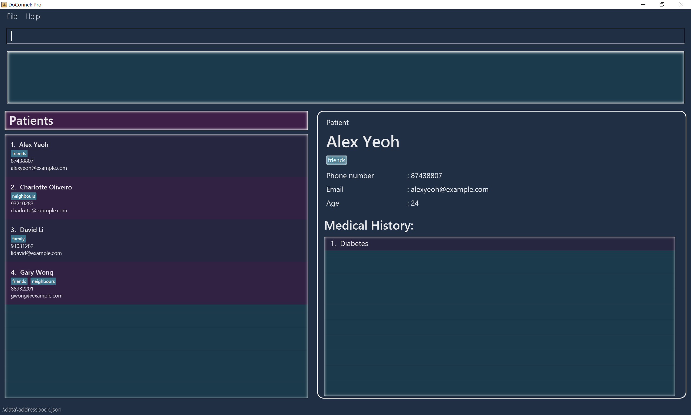
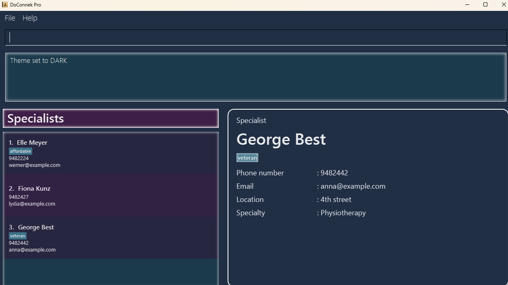
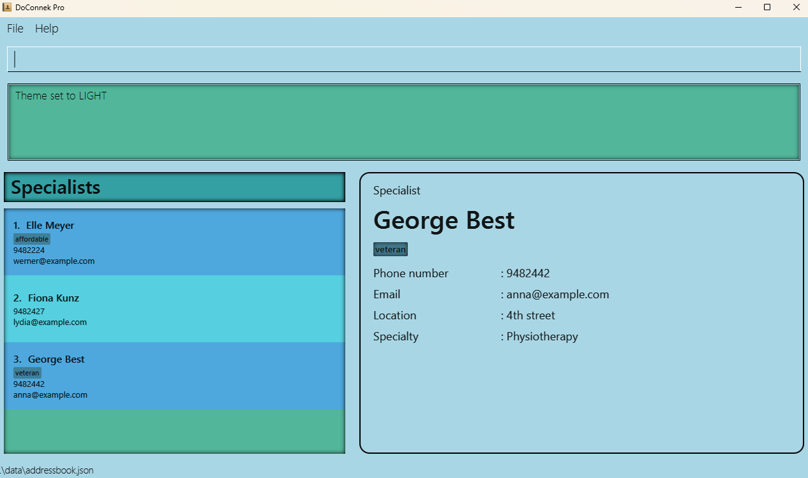

DoConnek Pro is a **desktop app** that helps **General Practitioner Clinic Management Staff** manage their **contact information for patients and specialists**. It is optimized for **Command Line Interface (CLI) users** while having a **Graphical User Interface (GUI)**. This allows frequent tasks to be completed faster by typing in commands.
* Table of Contents
{:toc}

--------------------------------------------------------------------------------------------------------------------

## Quick start

1. Ensure you have Java `11` or above installed in your Computer.

1. Download the latest `DoConnekPro.jar` from [here](https://github.com/AY2324S1-CS2103T-W13-1/tp/releases).

1. Copy the file to the folder you want to use as the _home folder_ for your DoConnek Pro.

1. Open a command terminal (You can search for the "Command Prompt" application on Windows or the "Terminal" application on macOS).

1. `cd` into the folder you put the jar file in ([How to use `cd`](https://www.lifewire.com/change-directories-in-command-prompt-5185508#:~:text=In%20the%20command%20prompt%20window%2C%20type%20cd%20followed%20by%20the,the%20one%20you're%20in.&text=If%20you%20want%20to%20go,back%20to%20the%20original%20option.)).

1. Use the `java -jar DoConnekPro.jar` command to run the application. 
   A GUI similar to the below should appear in a few seconds. Note how the app contains some sample data. 
   

1. Type the command in the command input box at the top and press Enter to execute it. e.g. typing **`help`** and pressing Enter will open the help window. 
   Some example commands you can try:

   * `list -pa` : Lists all patients.

   * `add -pa n/John e/johnmctavish@gmail.com p/12345678 a/35 m/Osteoporosis m/Rheumatoid arthritis` : Adds a patient named `John` to the list.

   * `delete 3` : Deletes the 3rd person shown in the current list.

   * `clear` : Deletes all contacts.

   * `exit` : Exits the app.

1. Refer to the [Features](#features) below for details of each command.

--------------------------------------------------------------------------------------------------------------------

## Features

**:information_source: Notes about the command format:** 

* Words in `UPPER_CASE` are the parameters to be supplied by the user. 
  e.g. in `add -pa n/NAME`, `NAME` is a parameter which can be used as `add -pa n/John Doe`.

* Certain commands require `-PERSON_TYPE` as a parameter. This parameter can only take two values: `-pa` or `-sp`
and specifies whether the command is to act on the patients (`-pa`) or on the specialists (`-sp`) in the address book.

* Items in square brackets are optional. 
  e.g. `n/NAME [m/MEDICAL_HISTORY]` can be used as `n/John Doe m/Osteoporosis` or as `n/John Doe`.

* Items with `…`​ after them can be used multiple times but must include at least one entry. 
  e.g. `INDEX…​` can be used as `1` , `1 2 3`, `4 5 6 7 8`, but _**not**_ ` ` (i.e. 0 times).

* Items with both square brackets and `…`​ can be used multiple times, including zero times as they are optional. 
  e.g. `[m/MEDICAL_HISTORY]…​` can be used as ` ` (i.e. 0 times), `m/Osteoporosis`, `m/Osteoporosis m/Asthma` etc.

* Parameters can be in any order. 
  e.g. if the command specifies `n/NAME p/PHONE_NUMBER`, `p/PHONE_NUMBER n/NAME` is also acceptable.

* Extraneous parameters for commands that do not take in parameters (such as `help`, `exit` and `clear`) will be ignored. 
  e.g. if the command specifies `help 123`, it will be interpreted as `help`.

* Commands with parameters that require prefixes do not accept forward slash `/` as arguments. 
  e.g. adding a specialist with the name `Nagaratnam s/o Suppiah`: `add -sp n/Nagaratnam s/o Suppiah e/example@gmail.com p/12345678 s/Surgery l/Raffles` will result in an error.

* If you are using a PDF version of this document, be careful when copying and pasting commands that span multiple lines as space characters surrounding line-breaks may be omitted when copied over to the application.

### Viewing help : `help`

Shows a message explaining how to access the help page.

Format: `help`

### Adding a patient or specialist: `add`

Adds a patient or specialist to DoConnek Pro records.

Format (for patients): `add -pa n/NAME e/EMAIL p/PHONE_NUMBER a/AGE [m/MEDICAL_HISTORY]...​ [t/TAG]...​` 

:bulb: **Tip:**
A patient can have any number of medical histories and tags (including 0)

Format (for specialists): `add -sp n/NAME e/EMAIL p/PHONE_NUMBER s/SPECIALISATION l/LOCATION [t/TAG]...​`

:bulb: **Tip:**
A specialist can have any number of tags (including 0)

Parameter specifications: 
* `NAME`, `EMAIL`, `LOCATION`, `TAG`, `MEDICAL_HISTORY`, and `SPECIALISATION` can contain 1 - 255 alphanumeric characters.
* `PHONE_NUMBER` can contain 4 - 15 numeric characters.
* `AGE` can contain any integer in the range 0 to 149 inclusive.

Examples:
* `add -pa n/John e/johnmctavish@gmail.com p/12345678 a/35 m/Osteoporosis m/Rheumatoid arthritis t/friend`
* `add -sp n/Jane e/janepeter@gmail.com p/73331515 s/Dermatologist l/Ang Mo Kio`

### Listing patient or specialist records: `list`

Shows a list of all patients or specialists in stored records.

Format: `list -PERSON_TYPE`

Examples:
* `list -pa` Lists all patients in records.
* `list -sp` Lists all specialists in records.

### Locating patients or specialists by their attributes: `find`

Finds patients or specialists whose attributes contain any of the given keywords. 
Multiple attributes can be searched at once, the result will display any person
with all attributes containing any of the corresponding keywords in the command.

Format: `find -PERSON_TYPE [PREFIX/KEYWORD]...`

* All prefixes are optional. Hence, entering `find -PERSON_TYPE` (without any prefixes) will result in all person of the specified type being listed.
* The search is case-insensitive.
  * e.g `hans` will match `Hans`
* The order of the keywords does not matter. 
  * e.g. `Hans Bo` will match `Bo Hans`
* There are different behaviours regarding the searching of different parameters:
  * For `NAME`, `MEDICAL_HISTORY`, `SPECIALISATION`, `EMAIL`, `LOCATION` and `PHONE_NUMBER`, even substrings will be matched. 
    * e.g. `ha` will match `Hans`
  * For `AGE` and `TAGS` only full words will be matched. 
    * e.g. `1` will not match `18`
* Persons matching at least one keyword will be returned (i.e. `OR` search).
  * The keywords will be separated out by whitespaces e.g. `hans bo` is akin to searching for `hans` and `bo` simultaneously.
    * e.g. `Hans Bo` will return `Hans Gruber`, `Bo Yang`

Examples:
* `find -pa n/John` returns the patient `Johnny Depp` and the patient `John Doe`
* `find -sp n/alex david` returns the specialists `Alex Yeoh` and `David Li` 
* `find -sp n/Alex s/Orthopaedic` returns any specialists names including the string `Alex` who has the `Orthopaedic` specialty
 

**:information_source: About the list header:** 

DoConnek Pro's interface comes with a handy list header that shows whether you are viewing `Patients` or `Specialists`.

If for any reason there is no data to show, for example:
* There is no existing `Patient` data when listing `Patients`.
* A `find` query returns no matching results.

The list header will show `No data found` instead.

### Viewing a patient or specialist record in more detail `view`

Displays detailed information about a patient or specialist in the view panel.
The view panel is located to the right of the person list.

Format: `view INDEX`

* The index refers to the index number shown in the displayed person list.
* The index **must be a positive integer** 1, 2, 3, …​ with a maximum value of the list size.

Example:
* `list -pa` followed by `view 2` displays the detailed information of the 2nd listed patient in the view panel.

### Editing a pre-existing patient or specialist record: `edit`

Edits the data of the pre-existing patient or specialist record currently being displayed in the view panel.
Multiple attributes of a person can be changed at once. The view panel will be updated with the
modified results immediately after each successful `edit` command execution.

Format: `edit PREFIX/KEYWORD…​`

* When entering an `edit` command, at least one valid prefix must be present. 
I.e. entering `edit` (without any prefixes) will result in an error message being displayed.
* Only the patient or specialist in the view panel will be edited. Hence, when editing a specialist specific attribute
while viewing a patient (or vice versa), an error message be displayed.
  * e.g. when a patient is present in the view panel, `edit s/Dentistry` will result in an error message being displayed as
  patients do not have the specialty attribute.
* The new values of compulsory attributes for a patient or specialist cannot be empty.
  * e.g. `edit s/` (empty Specialty attribute) will result in an error when trying to edit a specialist.
  * e.g. `edit n/` (empty Name attribute) will result in an error when trying to edit a patient or specialist.
* The new values of optional attributes can be empty. This is useful when you want to clear the content of optional attributes 
in a patient or specialist.
  * e.g. `edit t/` (empty Tag attribute) will remove the tags of the patient or specialist being displayed in the view panel.

Examples:
* `list -pa` > `view 1` > `edit n/John Wick` modifies the name of the first patient in the list to `John Wick`.
*  `find -sp t/friend` > `view 3` > `edit s/Surgery` modifies the specialty of the third specialist in the list with
the `friend` tag.
 

### Deleting a patient or specialist : `delete`

Deletes the specified patients or specialists from the stored records.

Format: `delete INDEX…​`

* Deletes all persons at the specified `INDEX…​`.
* The index refers to the index number shown in the displayed person list.
* The index **must be a positive integer** 1, 2, 3, …​ with a maximum value of the list size.
* The indexes must **not** contain any duplicate integers.

Examples:
* `list -pa` followed by `delete 2` deletes the 2nd patient in the listed patients.
* `find -sp s/Orthopaedic` followed by `delete 2 3 4` deletes the 2nd, 3rd and 4th specialist listed in the `find` command.

### Undo previous entry : `undo`

Undo the previous command, stackable. (Able to keep undo-ing till there are no commands left to be undone)

Format: `undo`

### Redo previous undo : `redo`

Redo the previous 'undo', stackable. (Able to keep redoing-ing till there are no undo left to be redone)

Format: `redo`

### Adding a custom shortcut : `addsc`

Adds a shortcut mapped to a default command keyword for easier use.  
After the mapping, the new user-defined shortcut will work the same way as the command keyword, and will be preserved between user sessions.

A command keyword can have multiple valid shortcuts mapped to it.
* i.e. both `del --> delete` and `rm --> delete` mappings can exist concurrently.

A valid shortcut cannot be mapped to multiple command words at once
* i.e. both `e --> edit` and `e --> exit` mappings **cannot** exist concurrently.
* If such a duplicate mapping is attempted, the previous one will be overridden.

Format: `addsc sc/SHORTCUT kw/KEYWORD`
 * `SHORTCUT` can only consist of alphanumeric characters and must contain no whitespaces.
 * `SHORTCUT` cannot be an existing command keyword.
 * `KEYWORD` must match an existing command keyword.

Examples:
* `addsc sc/del kw/delete` maps `del` to the `delete` command keyword.
  * i.e. `del 3` will work the same as `delete 3`.

### Deleting custom shortcuts : `delsc`

Deletes the previously user-defined shortcuts.
You can use `delsc` to try and delete multiple shortcut mappings at once. 

If some shortcut mappings you try to delete did not exist originally, 
DoConnek Pro will notify you while proceeding with deleting those existing shortcut mappings anyway.

Format: `delsc sc/SHORTCUT...​`
* `SHORTCUT` should match a previously user-defined shortcut.

Examples:
* `delsc sc/del sc/abc` when both `del` and `abc` are mapped to some command keyword will remove the previous mappings of `del` and `abc`.
* `delsc sc/del sc/abc` when only `del` is mapped to some command keyword will remove the previous mapping of `del`, while notifying you that `abc` was not previously mapped to anything.

### Changing the Theme : `theme`

Changes the theme of the application. The default theme on launch is always the dark theme.

Format: `theme THEMETYPE`
* `THEMETYPE` has the following possibilities: `dark`, `light` (case-insensitive)

Examples:
* `theme dark` sets the application theme to the dark theme.

* `theme LIGHT` sets the application theme to the light theme.

### Clearing all entries : `clear`

Clears all patient and specialist entries from the stored records.

Format: `clear`

### Exiting the program : `exit`

Exits the program.

Format: `exit`

### Recalling Recent Commands

Similar to the [CLI of Unix](https://www.osc.edu/book/export/html/3022), the CLI of DoConnek Pro provides the functionality of
recalling recent commands by pressing the 'up arrow' and the 'down arrow' on the keyboard.

DoConnek Pro maintains a history of the 20 most recent commands the user has entered.

The user can recall the 20 most recently entered commands by pressing the up arrow on the keyboard. Each press of the
up arrow cycles one command further back in the history.

If the user goes too far back in history, they can 'undo' an 'up arrow' by pressing the down arrow.

### Save and Load Data

The patient and specialist data will automatically be saved to the device’s hard drive every time the data is updated, and will automatically be loaded when the user starts the application. The user does not need to manually save any data.

### Editing the data file

DoConnek Pro data are saved automatically as a JSON file `[JAR file location]/data/addressbook.json`. Advanced users are welcome to update data directly by editing that data file.

:exclamation: **Caution:**
If your changes to the data file makes its format invalid, DoConnek Pro will discard all data and start with an empty data file at the next run. Hence, it is recommended to take a backup of the file before editing it.

--------------------------------------------------------------------------------------------------------------------

## FAQ

**Q**: How do I transfer my data to another Computer? 
**A**: Install the app in the other computer and overwrite the data folder it creates with the data folder in your previous DoConnek Pro home directory.

--------------------------------------------------------------------------------------------------------------------

## Known issues

1. **When using multiple screens**, if you move the application to a secondary screen, and later switch to using only the primary screen, the GUI will open off-screen. The remedy is to delete the `preferences.json` file created by the application before running the application again.

--------------------------------------------------------------------------------------------------------------------

## Command summary

| Action               | Format, Examples                                                                                                                                                                               |
|----------------------|------------------------------------------------------------------------------------------------------------------------------------------------------------------------------------------------|
| **Help**             | `help`                                                                                                                                                                                         |
| **Add (patient)**    | `add -pa n/NAME e/EMAIL p/PHONE_NUMBER a/AGE [m/MEDICAL_HISTORY]...​ [t/TAG]...​`   e.g., `add -pa n/John e/johnmctavish@example.com p/12345678 a/21 m/Osteoporosis m/Rheumatoid arthritis` |
| **Add (specialist)** | `add -sp n/NAME e/EMAIL p/PHONE_NUMBER s/SPECIALISATION l/LOCATION [t/TAG]...​`   e.g., `add -sp n/Jane e/janepeter@example.com p/73331515 s/Dermatologist l/Ang Mo Kio`                    |
| **Delete**           | `delete INDEX...​`  e.g., `delete 3`                                                                                                                                                        |
| **Find**             | `find -PERSON_TYPE PREFIX/KEYWORD...`   e.g., `find -pa n/James Jake p/73281193`                                                                                                            |
| **Edit**             | `edit PREFIX/KEYWORD...`   e.g. `edit n/Jonathan Wick p/09883100`                                                                                                                           |
| **List**             | `list -PERSON_TYPE`   e.g. `list -pa`                                                                                                                                                       |
| **Undo**             | `undo`                                                                                                                                                                                         |
| **Redo**             | `redo`                                                                                                                                                                                         |
| **Add shortcut**     | `addsc sc/SHORTCUT kw/KEYWORD`   e.g., `addsc sc/del kw/delete`                                                                                                                             |
| **Delete shortcut**  | `delsc sc/SHORTCUT...`   e.g., `delsc sc/del sc/li`                                                                                                                                         |
| **Change Theme**     | `theme THEMETYPE`   e.g., `theme dark`                                                                                                                                                      |
| **Clear**            | `clear`                                                                                                                                                                                        |
| **Exit**             | `exit`                                                                                                                                                                                         |
